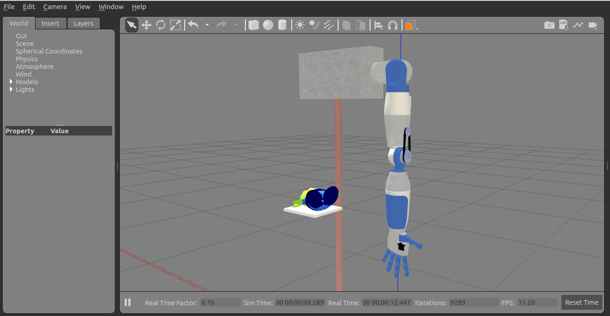
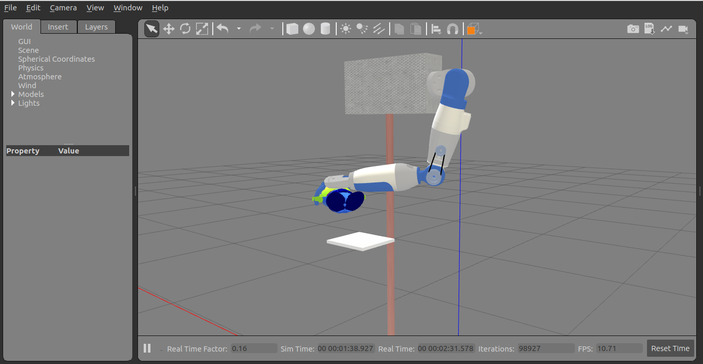

# Brazo robótico antropomórfico: Alien
Simulación de un brazo robótico antropomórfico que tiene como objetivo detectar colisiones. 

## Tecnologías
- ROS 2 Iron
- Gazebo clásico
- Ubuntu 22.04

## Comandos para ejecutar
1. Compilar 
```
colcon build
```
2. Cargar el entorno 
```
source install/setup.bash
```
3. Lanzar el mundo 
```
ros2 launch xolobot_arm xolobot_arm_control.launch.py
```
4. Ejecutar
```
ros2 run xolobot_arm_server xolobot_arm_server
```
## Capturas de pantalla
### Brazo sin movimiento


### Ejecución

